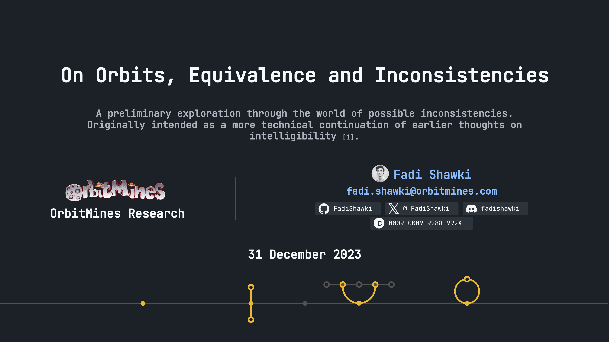

# orbitmines.com
*A public repository for [orbitmines.com](https://orbitmines.com). The hub for OrbitMines' (research) projects.*

*Once a Minecraft server, now a research project dedicated to understanding arbitrarily unknown dynamical systems.*


## [What is this?, What is OrbitMines?, What are Rays?](https://github.com/orbitmines/ray)

---

## Where is OrbitMines going with this? - i.e. Future inquiries

Check out everything I've made public regarding this here: [GitHub Issues](https://github.com/orbitmines/orbitmines.com/issues) or equivalently, check the Discord channels grouped under the name: [Fractals of the Galaxy](https://discord.com/channels/1055502602365845534/1114584997702156388).

---

### Local setup

- Running `orbitmines.com` locally on `http://localhost:3000`:
  - ```shell
    git clone git@github.com:orbitmines/orbitmines.com.git
    ```
  - ```shell
    cd ./orbitmines.com/orbitmines.com
    ``` 
  - ```
    npm install
    ```
  - ```
    npm start
    ```

[//]: # (- Running tests.)

[//]: # (  - ```shell)

[//]: # (    npm run test -- --watchAll)

[//]: # (    ```)

---

## Latest Writing
https://orbitmines.com/papers/on-orbits-equivalence-and-inconsistencies/


---

## License Magic

I'm not convinced putting licenses on the repo's in the usual case is anything other than *Minecraft servers putting "Not affiliated with Mojang" in their stores* just because everyone else does it. But here: after doing absolutely no research into the international ramifications: [LICENSE](./LICENSE) a license for those who like to look at them. Try to reason to what that applies in this repository, obviously that doesn't cover everything not made by me or other contributions to OrbitMines or something. Just put a reference to me or this project somewhere if it's remotely interesting to you.

